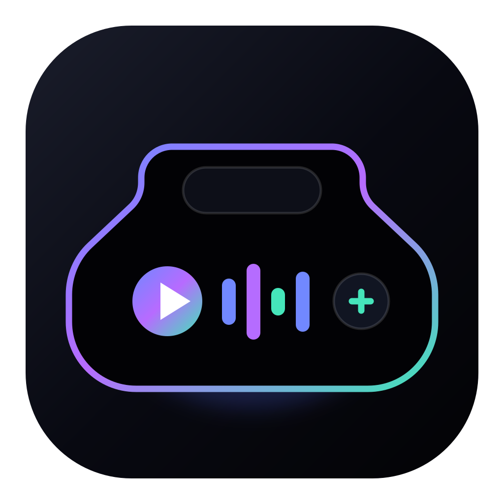
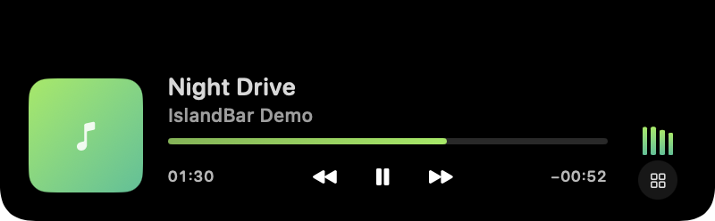

<div align="center">
  
  <h1>IslandBar</h1>
  <p>A native Dynamic Island experience built around the MacBook notch.</p>
  <p><a href="README_RU.md">Русская версия</a></p>
</div>



IslandBar is an original, local-first macOS app. It stays invisible when idle, appears when you hover over the physical notch, and turns music, focus tools, files, clipboard history, and small utilities into one fluid top-of-screen interface.

## Highlights

- Notch-aware idle, compact Live Activity, and expanded layouts
- Apple Music and Spotify artwork, progress, controls, and artwork-derived colors
- Smooth interruptible transitions with no external border or floating shadow
- Drag-and-drop file shelf with Finder and AirDrop actions
- In-memory clipboard history for text, images, and files
- Pomodoro, timer, stopwatch, calendar, reminders, and quick app launcher
- Local camera mirror, mini browser, notes, bookmarks, counters, and day tracking
- Battery, Wi-Fi RSSI, and network throughput indicators
- Launch at login, pinning, and hover behavior settings

## Requirements

- Apple Silicon Mac
- macOS 14 or newer
- A MacBook with a physical notch is recommended

IslandBar does not use third-party Swift packages or private macOS frameworks. It has no account requirement, proprietary backend, or telemetry. Internet access is used only by user-facing features such as Spotify artwork retrieval and the mini browser.

## Build

The full Xcode application is not required. Command Line Tools with the macOS SDK are enough:

```sh
git clone https://github.com/Fed0rNV/IslandBar.git
cd IslandBar
./build.sh
```

The signed local build is written to `dist/IslandBar.app`. Move it to `/Applications` before enabling launch at login.

Because release builds use a local ad-hoc signature, macOS may ask you to right-click the app and choose **Open** on first launch.

## Permissions and privacy

IslandBar requests a system permission only when the related feature is used:

- Automation for Apple Music and Spotify controls
- Calendar and Reminders for events and tasks
- Camera for the local mirror view
- Notifications for completed timers

Settings are stored in `UserDefaults`. Clipboard history remains in memory and can be disabled; the file shelf stores paths instead of copying files. The mini browser uses the standard `WKWebView` website storage and cache.

## Media limitation

macOS has no stable public API for reading complete global “Now Playing” metadata from every application. Full metadata and accurate seeking are therefore implemented for Apple Music and Spotify. Browser playback can still respond to system media keys, but title and progress information may be unavailable.

## License

IslandBar is available under the [MIT License](LICENSE).

IslandBar is not affiliated with NotchBox or Apple and does not use their code, branding, icons, or artwork.
